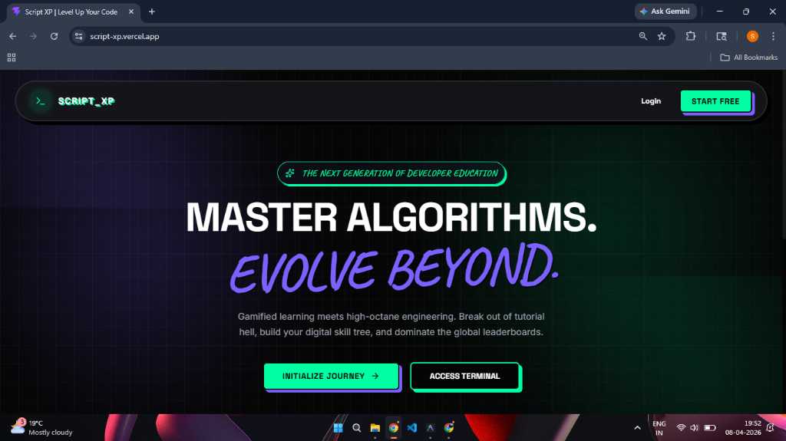
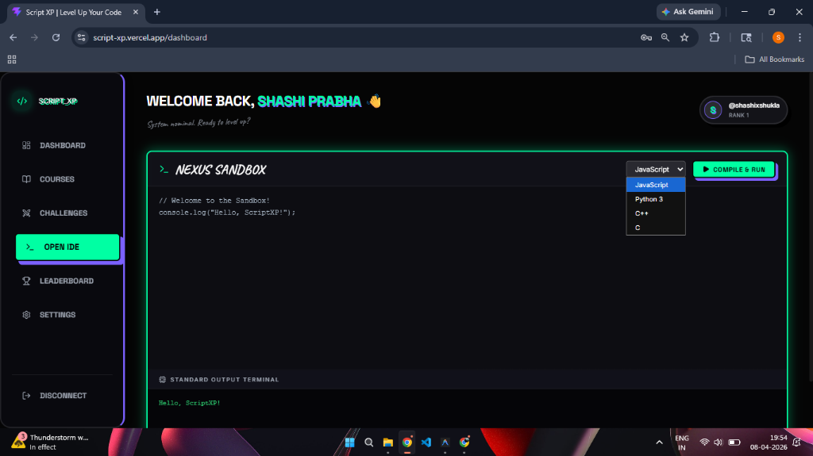
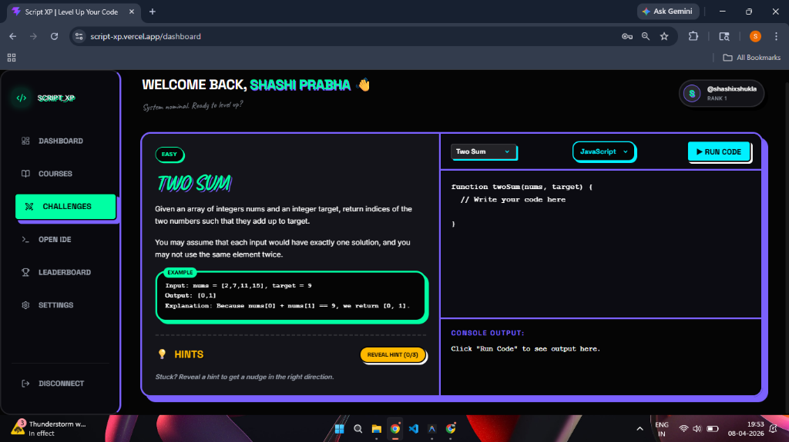
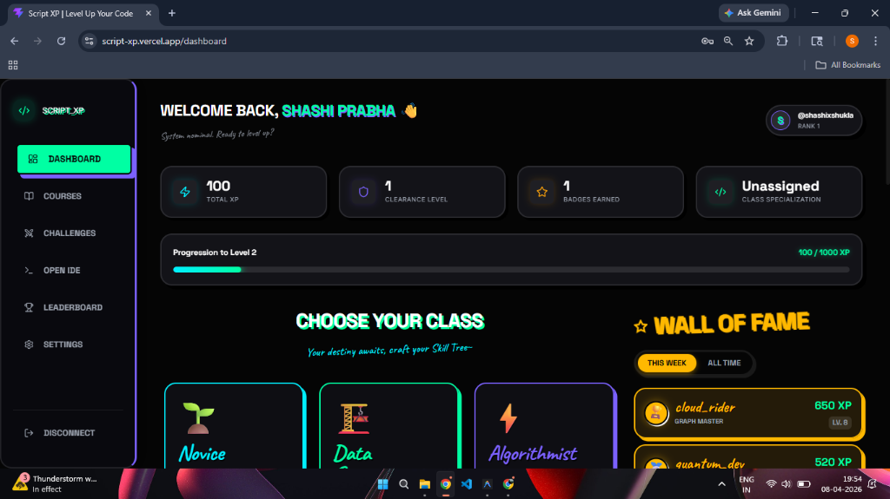

<div align="center">
  <h1>🌟 ScriptXP</h1>
  <p><strong>A Gamified Execution Engine & Coding Platform</strong></p>
  
  <p>
    
    
    
    
  </p>
</div>

---

## 🚀 Welcome to the Nexus
**ScriptXP** is a playful, brutalist-themed programming environment designed to make solving algorithms completely addictive. Why settle for generic text-editors when you can rank up natively?

By combining robust native execution engines with an aesthetic, gamified progression loop, ScriptXP allows developers to practice, compile, and battle-test their logic across multiple languages directly in the browser.

## 🖼️ Interface Showcase
<div align="center">
  
   
  
  
</div>

## ✨ Core Features
* ⚔️ **Native Code Execution:** Write and securely compile Python, C++, C, or JavaScript remotely using our ultra-fast `child_process` backend architecture.
* 🏆 **Gamification Engine:** Earn XP, conquer Daily Challenges, and acquire exclusive Badges (like *Early Adopter*) directly attached to your Neural Link profile!
* 🌐 **Global Leaderboards:** Track your rank globally against other coders dynamically.
* 🎨 **Playful Brutalism:** A highly reactive, high-contrast, Gen-Z interface boasting heavy shadows, glowing neon, and glassmorphic panels.

## 🛠 Tech Stack
| Component | Technology |
| :--- | :--- |
| **Frontend** | React, Vite, Framer-Motion, Vanilla CSS |
| **Backend** | Node.js, Express.js |
| **Database** | MongoDB & Mongoose |
| **Authentication**| JWT & Custom Secure Passkeys |
| **Compiler** | GCC, G++, Python Native Instances |

## ⚙️ Local Deployment

### 1. Initialize the Source
```bash
git clone https://github.com/shashihere/ScriptXP.git
cd ScriptXP/ScriptXP
```

### 2. Environment Variables
Create `.env` files in both the client and server directories following their respective `.env.example` configurations. Your MongoDB URI and JWT secrets are required.

### 3. Server Ignition
```bash
cd server
npm install
npm run dev
```
*(Ensure your host machine has python, gcc, and g++ installed for local execution)*

### 4. Client Ignition
In a separate terminal:
```bash
cd client
npm install
npm run dev
```

---
<div align="center">
  <p>Architected for the next generation of engineers.</p>
</div>
